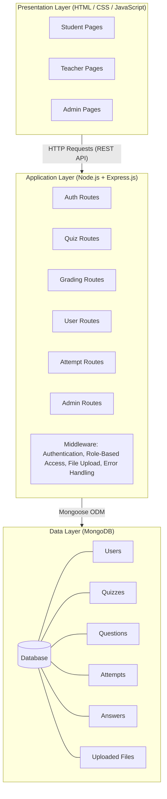
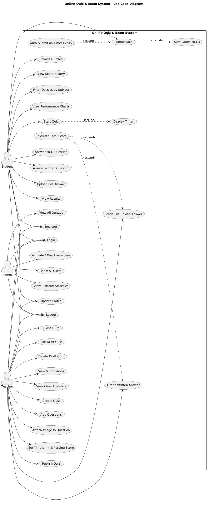
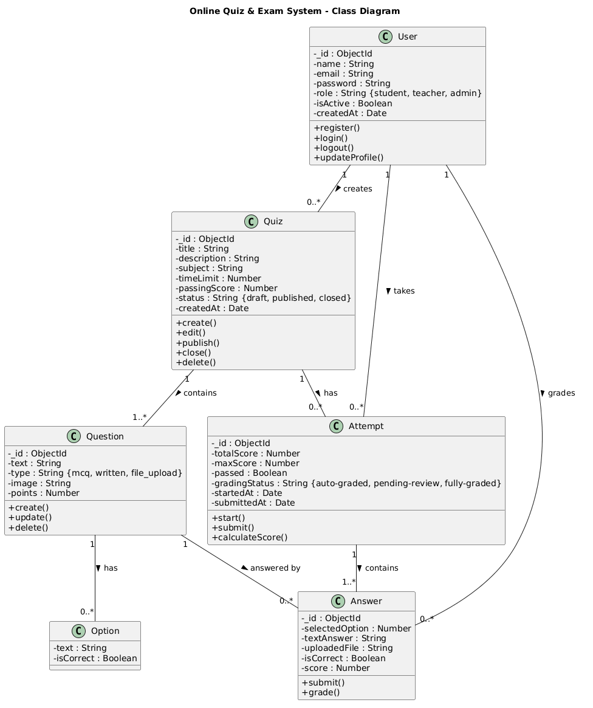
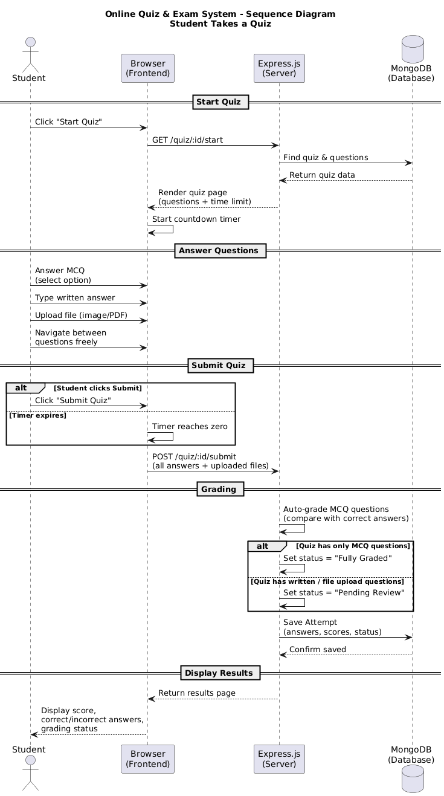
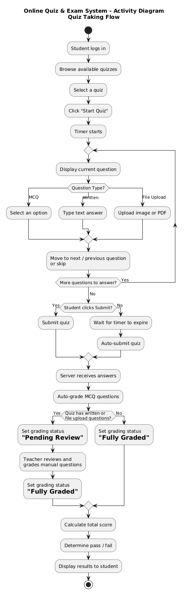
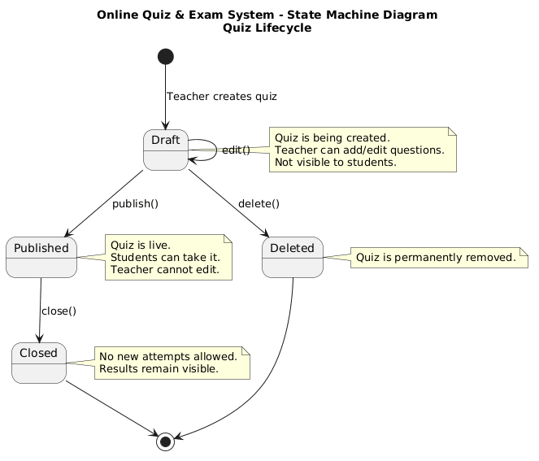
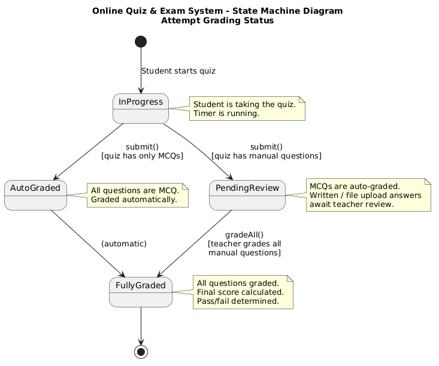

# Online Quiz & Exam System (QuizHub)

## Cover Page

- **Project Name:** Online Quiz & Exam System
  <!-- - **Team Members:** Gehad Khaled Elsamadisy, [Member 2], [Member 3], [Member 4], [Member 5], [Member 6] -->
    <!-- - **Course Name:** Software Engineering -->
    <!-- - **Instructor Name:** [Instructor Name] -->
    <!-- - **Submission Date:** [Date] -->

---

## Phase 1: Requirements

### 1.1 Problem Statement

Traditional examination and assessment methods rely heavily on paper-based processes, which present several challenges for both educators and students. Teachers spend significant time creating, distributing, collecting, and grading exams manually. Grading is slow and error-prone, especially for large classes, and students often wait days or weeks to receive their results. There is no centralized way for students to track their performance over time or for teachers to analyze class-wide trends.

Furthermore, paper-based exams are limited to a single format (written answers), making it difficult to incorporate diverse question types. Managing and storing physical exam papers is inefficient and risks data loss.

The Online Quiz & Exam System addresses these problems by providing a digital platform where teachers can create quizzes with multiple question types, students can take them online with instant feedback on auto-gradable questions, and all results are stored and analyzed in one place.

### 1.2 System Scope

#### In Scope

The system will provide the following capabilities:

- **User Management:** Registration, login, and profile management for Students, Teachers, and Admins.
- **Quiz Creation:** Teachers can create quizzes with a title, description, subject, time limit, and passing score. Each quiz contains questions created directly within it.
- **Multiple Question Types:**
  - Multiple Choice Questions (MCQ) with single correct answer
  - Written/typed answer questions (free-text response)
  - File upload questions (student submits an image or PDF as their answer)
- **Image Attachments:** Teachers can attach images (diagrams, graphs, photos) to any question.
- **Quiz Taking:** Students can browse available quizzes, take them with a countdown timer, and submit their answers.
- **Auto-Grading:** MCQ answers are graded automatically upon submission.
- **Manual Grading:** Teachers can review and grade written and file upload answers manually.
- **Results & Review:** Students can view their scores and review correct/incorrect answers after grading is complete.
- **Score History:** Students can view their past attempts and track performance over time.
- **Analytics Dashboard:** Teachers can view class performance statistics (averages, pass/fail rates, score distribution). Students can view personal performance trends.
- **Admin Panel:** Admins can manage user accounts, view all quizzes, and monitor platform statistics.

#### Out of Scope

The system will **not** include:

- Live exam proctoring or video monitoring
- Payment or subscription features
- Real-time chat or messaging between users
- Mobile application (web only)
- Essay auto-grading using AI or natural language processing
- Integration with external Learning Management Systems (LMS)

### 1.3 Functional Requirements

#### 1.3.1 Authentication & User Management

| ID    | Requirement                                                                                                                     |
| ----- | ------------------------------------------------------------------------------------------------------------------------------- |
| FR-01 | The system shall allow users to register with a name, email, password, and role (Student or Teacher).                           |
| FR-02 | The system shall allow registered users to log in using email and password.                                                     |
| FR-03 | The system shall allow users to log out and terminate their session.                                                            |
| FR-04 | The system shall allow users to view and update their profile information.                                                      |
| FR-05 | The system shall enforce role-based access: Students, Teachers, and Admins shall only access features permitted for their role. |

#### 1.3.2 Quiz Management (Teacher)

| ID    | Requirement                                                                                                             |
| ----- | ----------------------------------------------------------------------------------------------------------------------- |
| FR-06 | The system shall allow teachers to create a new quiz with a title, description, subject, time limit, and passing score. |
| FR-07 | The system shall allow teachers to add questions to a quiz with the following types: MCQ, Written, or File Upload.      |
| FR-08 | The system shall allow teachers to attach an image to any question.                                                     |
| FR-09 | The system shall allow teachers to define MCQ options and mark the correct answer.                                      |
| FR-10 | The system shall allow teachers to set a point value for each question.                                                 |
| FR-11 | The system shall allow teachers to save a quiz as Draft (not visible to students).                                      |
| FR-12 | The system shall allow teachers to publish a quiz, making it available to students.                                     |
| FR-13 | The system shall allow teachers to close a quiz, preventing new attempts.                                               |
| FR-14 | The system shall allow teachers to edit a quiz only while it is in Draft status.                                        |
| FR-15 | The system shall allow teachers to delete a quiz only while it is in Draft status.                                      |
| FR-16 | The system shall allow teachers to view a list of all their created quizzes with status indicators.                     |

#### 1.3.3 Quiz Taking (Student)

| ID    | Requirement                                                                                                 |
| ----- | ----------------------------------------------------------------------------------------------------------- |
| FR-17 | The system shall display a list of published quizzes available to students.                                 |
| FR-18 | The system shall allow students to filter quizzes by subject.                                               |
| FR-19 | The system shall allow students to start a quiz, which begins the countdown timer.                          |
| FR-20 | The system shall display questions one at a time or all at once, with navigation between questions.         |
| FR-21 | The system shall allow students to select an answer for MCQ questions.                                      |
| FR-22 | The system shall allow students to type a text answer for written questions.                                |
| FR-23 | The system shall allow students to upload an image or PDF file for file upload questions.                   |
| FR-24 | The system shall display a countdown timer that shows remaining time during the quiz.                       |
| FR-25 | The system shall automatically submit the quiz when the timer reaches zero.                                 |
| FR-26 | The system shall allow students to manually submit the quiz before the timer expires.                       |
| FR-27 | The system shall prevent students from taking the same quiz more than once (unless allowed by the teacher). |

#### 1.3.4 Grading & Results

| ID    | Requirement                                                                                                              |
| ----- | ------------------------------------------------------------------------------------------------------------------------ |
| FR-28 | The system shall automatically grade all MCQ questions upon quiz submission.                                             |
| FR-29 | The system shall mark quizzes containing written or file upload questions as "Pending Review".                           |
| FR-30 | The system shall allow teachers to view submitted answers for written and file upload questions.                         |
| FR-31 | The system shall allow teachers to assign a score to each manually graded question.                                      |
| FR-32 | The system shall calculate the total score after all questions have been graded.                                         |
| FR-33 | The system shall determine pass/fail status based on the teacher-defined passing score.                                  |
| FR-34 | The system shall allow students to view their results, including score, pass/fail status, and correct answers (for MCQ). |
| FR-35 | The system shall notify students when their quiz has been fully graded.                                                  |

#### 1.3.5 Analytics & Score History

| ID    | Requirement                                                                                                      |
| ----- | ---------------------------------------------------------------------------------------------------------------- |
| FR-36 | The system shall allow students to view their score history across all quizzes.                                  |
| FR-37 | The system shall display student performance trends over time using charts.                                      |
| FR-38 | The system shall allow teachers to view class-wide analytics: average score, pass/fail rate, score distribution. |
| FR-39 | The system shall allow teachers to identify the hardest questions based on student performance.                  |

#### 1.3.6 Admin Panel

| ID    | Requirement                                                                                                  |
| ----- | ------------------------------------------------------------------------------------------------------------ |
| FR-40 | The system shall allow admins to view a list of all registered users.                                        |
| FR-41 | The system shall allow admins to activate or deactivate user accounts.                                       |
| FR-42 | The system shall allow admins to view all quizzes across the platform.                                       |
| FR-43 | The system shall allow admins to view platform-wide statistics (total users, total quizzes, total attempts). |

### 1.4 Non-Functional Requirements

#### 1.4.1 Performance

| ID     | Requirement                                                                |
| ------ | -------------------------------------------------------------------------- |
| NFR-01 | Web pages shall load within 3 seconds under normal conditions.             |
| NFR-02 | The system shall handle at least 100 concurrent users without degradation. |
| NFR-03 | Quiz submission and auto-grading shall complete within 2 seconds.          |
| NFR-04 | File uploads shall support files up to 10 MB in size.                      |

#### 1.4.2 Security

| ID     | Requirement                                                                                    |
| ------ | ---------------------------------------------------------------------------------------------- |
| NFR-05 | User passwords shall be hashed before storage using a secure hashing algorithm (e.g., bcrypt). |
| NFR-06 | The system shall use session-based or token-based authentication to protect routes.            |
| NFR-07 | The system shall enforce role-based access control to prevent unauthorized actions.            |
| NFR-08 | File uploads shall be validated for type (only images and PDFs allowed) and size.              |
| NFR-09 | The system shall protect against common web vulnerabilities (XSS, SQL/NoSQL injection, CSRF).  |

#### 1.4.3 Usability

| ID     | Requirement                                                                                     |
| ------ | ----------------------------------------------------------------------------------------------- |
| NFR-10 | The user interface shall be intuitive and require no training to use.                           |
| NFR-11 | The system shall provide clear feedback messages for user actions (success, error, validation). |
| NFR-12 | The system shall be responsive and usable on both desktop and tablet browsers.                  |
| NFR-13 | Navigation shall be consistent across all pages with a clear menu structure.                    |

#### 1.4.4 Reliability

| ID     | Requirement                                                                                                |
| ------ | ---------------------------------------------------------------------------------------------------------- |
| NFR-14 | The system shall not lose student answers if the browser is accidentally closed during a quiz (auto-save). |
| NFR-15 | The system shall handle server errors gracefully and display user-friendly error pages.                    |
| NFR-16 | The system shall maintain data integrity — submitted answers and scores shall not be altered or lost.      |
| NFR-17 | The system shall be available 99% of the time during active use periods.                                   |

#### 1.4.5 Scalability

| ID     | Requirement                                                                                                 |
| ------ | ----------------------------------------------------------------------------------------------------------- |
| NFR-18 | The database design shall support growth in users, quizzes, and attempts without schema changes.            |
| NFR-19 | The system architecture shall allow adding new question types in the future with minimal code changes.      |
| NFR-20 | The file storage approach shall be scalable (e.g., can migrate to cloud storage like AWS S3 in the future). |
| NFR-21 | The system shall support horizontal scaling by keeping the application stateless where possible.            |

---

## Phase 2: Design

### 2.1 System Architecture

The Online Quiz & Exam System follows a **three-tier client-server architecture**, which separates the application into three distinct layers:

**Layer Descriptions:**

| Layer                  | Technology            | Responsibility                                                                                                                                               |
| ---------------------- | --------------------- | ------------------------------------------------------------------------------------------------------------------------------------------------------------ |
| **Presentation Layer** | HTML, CSS, JavaScript | User interface — forms, quiz-taking page, dashboards, charts. Sends HTTP requests to the server and renders responses.                                       |
| **Application Layer**  | Node.js, Express.js   | Business logic — handles authentication, quiz management, grading, file uploads, and API routing. Acts as the middleman between the client and the database. |
| **Data Layer**         | MongoDB (Mongoose)    | Data storage — stores users, quizzes, questions, attempts, answers, and scores. Handles data persistence and retrieval.                                      |

**Communication Flow:**

1. The client (browser) sends HTTP requests to the Express.js server via REST API endpoints.
2. The server processes the request, applies business logic, and interacts with MongoDB through Mongoose.
3. The server sends a response (HTML page or JSON data) back to the client.
4. For file uploads, the server uses Multer middleware to handle multipart form data and stores files on the server's file system.

### 2.2 Design Decisions

| Decision                 | Choice                            | Reasoning                                                                                                                                                                                                   |
| ------------------------ | --------------------------------- | ----------------------------------------------------------------------------------------------------------------------------------------------------------------------------------------------------------- |
| **Architecture Pattern** | Three-tier client-server          | Clear separation of concerns between UI, logic, and data. Easy to develop, test, and maintain independently.                                                                                                |
| **Frontend**             | HTML / CSS / JavaScript (vanilla) | No framework learning curve. All team members can contribute. Lightweight and fast. Sufficient for the project scope.                                                                                       |
| **Backend**              | Node.js with Express.js           | JavaScript on both frontend and backend reduces context switching. Express.js is minimal, flexible, and well-documented. Large ecosystem of middleware (Multer, bcrypt, etc.).                              |
| **Database**             | MongoDB with Mongoose             | Schema-flexible document model suits quizzes with varying question types. Mongoose provides structure through schemas while keeping MongoDB's flexibility. Easy to set up — no SQL table migrations needed. |
| **Authentication**       | Session-based (express-session)   | Simpler to implement than JWT for a server-rendered application. Sessions are stored server-side, providing better security for exam data.                                                                  |
| **File Upload**          | Multer (local file system)        | Built-in Express middleware — no external service needed. Files are stored locally on the server. Can be migrated to cloud storage (e.g., AWS S3) in the future if needed (NFR-20).                         |
| **Charts**               | Chart.js                          | Lightweight, no dependencies, works with vanilla JavaScript. Supports bar charts, pie charts, and line charts — sufficient for analytics dashboards.                                                        |
| **Password Security**    | bcrypt                            | Industry-standard hashing library. Automatically handles salting. Resistant to brute-force attacks.                                                                                                         |

### 2.3 UML Diagrams

#### 2.3.1 Use Case Diagram

The Use Case Diagram illustrates the interactions between the three system actors (Student, Teacher, and Admin) and the system's functionality. It shows include relationships (e.g., "Start Quiz" includes "Display Timer") and extend relationships (e.g., "Auto-Submit on Timer Expiry" extends "Submit Quiz").

_Figure 1: Use Case Diagram_

#### 2.3.2 Class Diagram

The Class Diagram represents the core data model of the system, showing six classes (User, Quiz, Question, Option, Attempt, Answer) with their attributes, methods, and relationships. Key relationships include: a User creates many Quizzes (1-to-many), a Quiz contains many Questions (1-to-many), a Student has many Attempts (1-to-many), and each Attempt contains many Answers (1-to-many).

_Figure 2: Class Diagram_

#### 2.3.3 Sequence Diagram

The Sequence Diagram describes the primary system interaction: **"Student Takes a Quiz"**. It shows the communication flow between four participants — Student, Browser (Frontend), Express.js Server, and MongoDB Database — from starting a quiz through answering questions, submitting, auto-grading MCQs, and displaying results.

_Figure 3: Sequence Diagram — Student Takes a Quiz_

#### 2.3.4 Activity Diagram

The Activity Diagram models the **quiz-taking flow** from the student's perspective. It includes decision points for question types (MCQ, Written, File Upload), looping through questions with free navigation, and branching for manual submission vs. auto-submission on timer expiry. After submission, the flow branches based on whether the quiz contains manual-grading questions (Pending Review) or only MCQs (Fully Graded).

_Figure 4: Activity Diagram — Quiz Taking Flow_

#### 2.3.5 State Machine Diagrams

Two state machines are defined for the system:

**State Machine 1: Quiz Lifecycle**

This diagram models the states a Quiz object transitions through during its lifecycle: Draft (being edited, not visible to students), Published (live, students can take it), Closed (no new attempts), and Deleted (permanently removed).

_Figure 5: State Machine Diagram — Quiz Lifecycle_

**State Machine 2: Attempt Grading Status**

This diagram models the grading status of a student's quiz attempt: In Progress (student is taking the quiz), Auto-Graded (all MCQs, graded automatically), Pending Review (has written/file upload questions awaiting teacher grading), and Fully Graded (all questions graded, final score calculated).

_Figure 6: State Machine Diagram — Attempt Grading Status_

